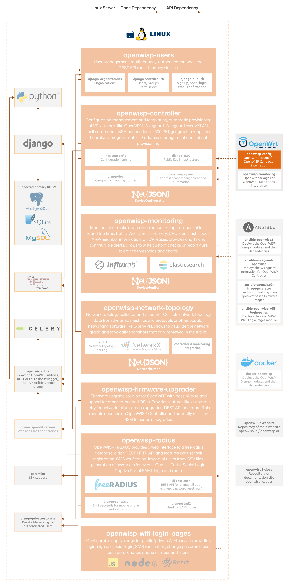

OpenWISP Config Agent
=====================

.. seealso::

    **Source code**: `github.com/openwisp/openwisp-config
    <https://github.com/openwisp/openwisp-config>`_.

OpenWISP Config is an `OpenWrt <https://openwrt.org/>`_ configuration
agent that automates network management tasks. It interfaces with the
OpenWISP Controller to streamline configuration deployment.

For a comprehensive overview of features, please refer to the
:doc:`user/intro` page.

The following diagram illustrates the role of the OpenWrt Config Agent
in the OpenWISP architecture.

    **OpenWISP Architecture: highlighted OpenWISP Config Agent for OpenWrt**

.. important::

    For an enhanced viewing experience, open the image above in a new
    browser tab.

    Refer to :doc:`/general/architecture` for more information.

.. toctree::
    :caption: OpenWrt Config Agent Usage Docs
    :maxdepth: 1

    ./user/intro.rst
    ./user/quickstart.rst
    ./user/settings.rst
    ./user/automatic-registration.rst
    ./user/hotplug-events.rst
    ./user/compiling.rst
    ./user/debugging.rst

.. toctree::
    :caption: OpenWrt Config Agent Developer Docs
    :maxdepth: 2

    developer/installation.rst
